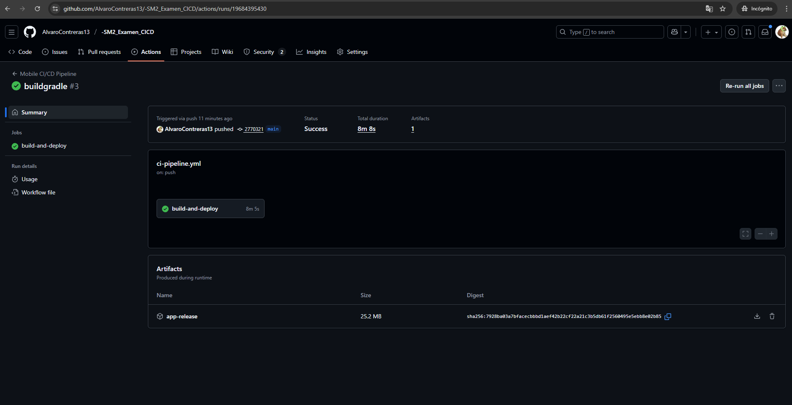

# Examen Unidad 3 - DevOps Móvil: Automatización y CI/CD

**Curso:** Soluciones Móviles II  
**Fecha:** 25/11/2025  
**Estudiante:** Alvaro Javier Contreras Lipa  
**Repositorio:** https://github.com/AlvaroContreras13/-SM2_Examen_CICD

---


## 📝 Descripción del Proyecto

Este proyecto implementa un sistema completo de **DevOps para aplicaciones móviles** usando GitHub Actions, que incluye:

1. **Automatización de Calidad** (Examen 1)
2. **Pipeline CI/CD Completo** (Examen 2)
3. **Generación automática de APK**

---

## 🎯 Objetivos Alcanzados

### Examen 1: Automatización de Calidad
- Creación de repositorio público en GitHub  
- Implementación de 19 pruebas unitarias del proyecto  
- Configuración de workflow `quality-check.yml`  
- Análisis automático de código con `flutter analyze`  
- Ejecución automática de tests con `flutter test`

### Examen 2: Pipeline CI/CD Completo
- Creación de 5 validadores basados en AuthService
- Implementación de 5 pruebas unitarias adicionales
- Configuración de workflow `ci-pipeline.yml`
- Construcción automática del APK de release
- Generación de artifacts descargables
- **Total: 24 pruebas unitarias (100% passed)**

---

## 🧪 Pruebas Unitarias Implementadas

### Examen 1: Pruebas del Proyecto (19 tests)

#### 1. TripStatus Tests (5 pruebas)
- Validación de estados válidos e inválidos
- Verificación de textos descriptivos
- Validación de colores hexadecimales

#### 2. AddressResolver Tests (5 pruebas)
- Manejo de datos nulos
- Resolución de direcciones desde coordenadas
- Formateo de ubicaciones

#### 3. RatingService Tests (9 pruebas)
- Validación de rangos de calificación
- Prevención de auto-calificación
- Gestión de calificaciones de usuarios

### Examen 2: Validators Tests (5 tests)

Se creó el archivo `lib/utils/validators.dart` con validaciones basadas en las reglas de negocio de AuthService:

| # | Función | Descripción | Uso en la App |
|---|---------|-------------|---------------|
| 1 | `isValidInstitutionalEmail` | Valida emails `@virtual.upt.pe` | Registro de usuarios |
| 2 | `isSecurePassword` | Valida contraseñas ≥ 6 caracteres | Firebase Authentication |
| 3 | `isValidDNI` | Valida DNI peruano (8 dígitos) | Identificación de usuarios |
| 4 | `isValidPeruvianPhone` | Valida teléfonos (9 dígitos, inicia con 9) | Contacto de usuarios |
| 5 | `isValidLicensePlate` | Valida placas vehiculares (ABC-123 o ABC-1234) | Registro de conductores |

---

## 🏗️ Estructura del Proyecto

```
SM2_Examen_CICD/
├── .github/
│   └── workflows/
│       ├── quality-check.yml      # Examen 1: Análisis + Tests
│       └── ci-pipeline.yml        # Examen 2: CI/CD + APK Build
├── test/
│   └── main_test.dart            # 24 pruebas unitarias (19 + 5)
├── lib/
│   ├── constants/
│   │   └── trip_status.dart
│   ├── utils/
│   │   ├── address_resolver.dart
│   │   └── validators.dart       # Examen 2
│   ├── services/
│   │   ├── rating_service.dart
│   │   └── auth_service.dart
│   └── ...
└── README.md
```

---

## 🔄 Workflows Configurados

### 1. Quality Check (Examen 1)
**Archivo:** `.github/workflows/quality-check.yml`

**Pasos:**
1. Checkout del código
2. Instalación de Flutter 3.29.0
3. Instalación de dependencias (`flutter pub get`)
4. Ejecución de tests (`flutter test`)

**Se ejecuta en:** Cada push o pull request a `main`

---

### 2. Mobile CI/CD Pipeline (Examen 2)
**Archivo:** `.github/workflows/ci-pipeline.yml`

**Pasos:**
1. Checkout del código
2. Instalación de Flutter 3.29.0
3. Instalación de dependencias (`flutter pub get`)
4. Análisis de calidad (`flutter analyze`)
5. Ejecución de pruebas unitarias (`flutter test`)
6. **Construcción del APK** (`flutter build apk --release`)
7. **Upload del APK como Artifact** (descargable)

**Se ejecuta en:** Cada push o pull request a `main`

---

## 📸 Evidencias

### Examen 1: Automatización de Calidad

#### 1. Estructura de carpetas .github/workflows/


#### 2. Contenido del archivo quality-check.yml


#### 3. Ejecución exitosa del workflow


#### 4. Detalle de la ejecución


---

### Examen 2: Pipeline CI/CD Completo

#### 1. Pruebas Unitarias Exitosas (24/24 passed)


**Resultado:** ✅ **24 tests passed** (100%)
- 19 tests del proyecto original
- 5 tests nuevos de Validators

---

#### 2. Construcción del APK Exitosa


**Resultado:** ✅ APK generado en `build/app/outputs/flutter-apk/app-release.apk`

---

#### 3. Artifact Descargable


**Ubicación:** GitHub Actions → Artifacts → `app-release.apk`  
**Disponible para descarga directa desde GitHub**

---

## 📊 Resultados Finales

### Examen 1
- **Tests ejecutados:** 19/19 
- **Tests pasados:** 19 (100%)
- **Tests fallidos:** 0
- **Análisis de código:** ✅ Completado

### Examen 2
- **Tests ejecutados:** 24/24 
- **Tests pasados:** 24 (100%)
- **Tests fallidos:** 0
- **Análisis de código:** ✅ Completado
- **APK generado:** ✅ Sí 
- **Artifact disponible:** ✅ Sí

---

## 🚀 Ejecución Local

### Instalar dependencias
```bash
flutter pub get
```

### Ejecutar todas las pruebas
```bash
flutter test test/main_test.dart
```


### Construir APK localmente
```bash
flutter build apk --release
```

---

## 📦 Dependencias de Testing

```yaml
environment:
  sdk: '>=3.7.0 <4.0.0'
  flutter: ">=3.29.0"

dev_dependencies:
  flutter_test:
    sdk: flutter
  flutter_lints: ^5.0.0
  build_runner: ^2.8.0
  fake_cloud_firestore: ^3.0.3
  firebase_auth_mocks: 0.14.2
  mockito: ^5.5.1
```

---

## 🛠️ Comandos Ejecutados en CI/CD

```bash
# 1. Instalación
flutter pub get

# 2. Pruebas unitarias
flutter test test/main_test.dart

# 3. Construcción del APK
flutter build apk --release

# 4. Upload del artifact
# (automático via GitHub Actions)
```

---

## Conclusiones

Se implementó exitosamente un **pipeline completo de DevOps** para aplicaciones móviles que:

### Examen 1: Automatización de Calidad
- Valida la calidad del código automáticamente
- Ejecuta pruebas unitarias en cada commit
- Garantiza estándares de código
- Previene integración de código con errores

### Examen 2: CI/CD Completo
- Todo lo anterior +
- **Construye el APK automáticamente**
- **Genera artifacts descargables**
- **Listo para distribución inmediata**
- **Proceso 100% automatizado**


